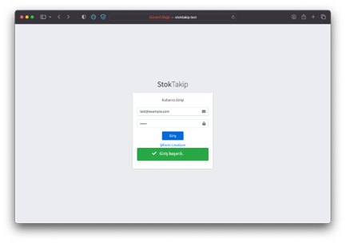

<b>Stok Takip Projesi</b>

Stok Takip Projesi, işletmelerin stok yönetimi süreçlerini daha etkin bir şekilde izlemelerini, kontrol etmelerini ve yönetmelerini destekleyen kapsamlı bir yazılım uygulamasını temsil etmektedir. Bu proje, işletmelerin stoklarını hassas bir şekilde takip etmelerini, gereksiz maliyetleri azaltmalarını ve müşteri memnuniyetini artırmalarını sağlar. Projeyi ilk başlattığınızda, kullanıcıların sisteme erişebilmek için kullanıcı girişi yapmaları gereken bir giriş ekranı ile karşılaşmaktayız. Bu giriş ekranı, sisteme erişimin sınırlı olduğunu ve güvenliği artırdığını vurgular. Kullanıcılar başarılı bir giriş yaptıktan sonra, sol tarafta bulunan bir sidebar ile karşılaşırlar. Bu sidebar, kullanıcının adı ve kullanıcı rolünün yanı sıra ürünler, satışlar, stoklar, kullanıcılar, kategoriler ve müşteriler gibi 6 farklı menüyü içerir. Her menünün altında, verileri eklemek ve listelemek için kullanabileceğiniz "ekle" ve "listele" adında iki alt menü bulunmaktadır. "Ekle" kısmında, her bir kategori için verileri ekleyebilir ve eklediğiniz bilgiler otomatik olarak veritabanına kaydedilir. "Listele" kısmına geldiğinizde ise veriler, bir DataTable üzerinde liste halinde görüntülenir. Bu veriler, veritabanından çekilmiştir ve düzenleme, gösterme ve silme işlemleri için her verinin yanında bulunan 3 farklı butonla erişilebilir hale getirilmiştir. "Düzenle" butonu tıklandığında, veritabanından bilgiler çekilir ve düzenlediğiniz herhangi bir bilgi, yapılan değişikliklerle birlikte veritabanına geri yüklenir. "Göster" butonu ise sadece okuma yetkisi olan verilerin bilgilerini gösterir ve değişiklik yapılmasına izin vermez. Her menü, kendi özel tablolarını ve detayları göstermek için tasarlanmıştır. Ayrıca, "Sil" butonu, verileri veritabanında pasif hale getirir ve listelerde görünmemesini sağlar. Rapor modülü, belirli tarih aralıklarında yapılan satışlar ve alımlar hakkında detaylı raporlar oluşturabilir, işletmenin performansını analiz etmelerine yardımcı olur. Sol taraftaki menülerin en altında, kullanıcıların sistemden çıkış yapmalarını sağlayan bir "Çıkış Yap" isimli buton bulunmaktadır. Bu proje, her kullanıcının rolüne göre farklı yetkilere sahip olduğu esnek bir sistem sunar ve işletmelerin stok yönetimi süreçlerini büyük ölçüde kolaylaştırır.

